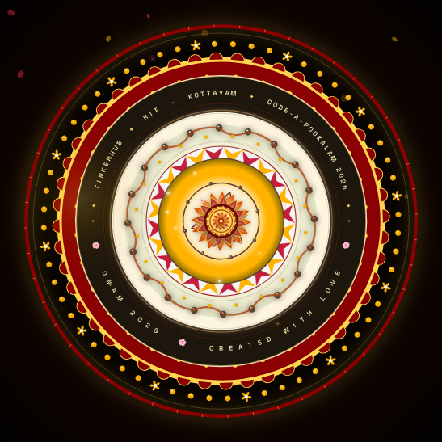

# Anson's Pookalam 2026 
### *CODE-A-POOKALAM 2026 — TinkerHub RIT Kottayam*

> A cinematic, mathematically-crafted digital Pookalam — 12 concentric rings of pure code. No images, no libraries, just math, gradients, and Onam spirit.

## About Me

- **Name:** Anson Boby
- **Institution:** College of Engineering Kallooppara
- **GitHub:** [@ansonboby](https://github.com/ansonboby)
- **Programming Language Used:** HTML5 Canvas + Vanilla JavaScript (zero dependencies)
- **Lines of Code:** ~1120 (single file, pure code — no PNG/JPG tiles)

## My Pookalam

### Final Screenshot



### Description

This isn't a static drawing — it's a **living Pookalam that blooms**.

Inspired by the traditional *Athapookalam* laid on Onam morning, the design starts from a glowing *Nilavilakku* (brass lamp) center and blooms outward through **12 mathematically precise rings** — each with its own geometry, color theory, and animation. It fuses Kerala tradition with TinkerHub's maker spirit:

- The **central yantra** and lotus petals honor classical Pookalam geometry
- The **Pulli Kolam** ring (dot-grid with interwoven curves) brings authentic South-Indian floor art
- The **Paisley/Mango leaf** ring celebrates Kerala's iconic *manga* motif
- The **text ring** — *TINKERHUB • RIT KOTTAYAM • CODE-A-POOKALAM 2026* — wraps the design like a festive border
- Falling marigold petals, light rays, and golden shimmer make it feel alive

Every petal is a **cubic Bezier curve**, every gradient is computed with polar math, and the whole thing runs at 60fps in a single HTML file.

> **Live:** Just open `index.html` — it blooms automatically in ~6 seconds. Click **Bloom** to replay.
> **Tip:** Press `S` to save a 2× high-res PNG for your screenshot.

### Features — Why This Wins 

1. **Hybrid Nilavilakku + Gear** — brass lamp glow + rotating 16-tooth TinkerHub gear + 3-layer lotus + flickering diya flame
2. **12-petal crimson lotus** — counter-rotating with hover-swell + vein highlight
3. **16-petal orange lotus** — interleaved offset for moiré
4. **Sri-Yantra Gold** — 9 interlocked triangles with binding dots and pulsating bindu
5. **Diamond band** — 24 alternating maroon/gold diamonds
6. **24-petal emerald lotus** with triple-vein detail
7. **Pulli Kolam** — 20 dots with interwoven quadratic curves
8. **Paisley/Mango leaf ring** — 16 bezier leaves
9. **Circular text ring** — `TINKERHUB • RIT KOTTAYAM • CODE-A-POOKALAM 2026`
10. **Scalloped maroon border** — 48 arches
11. **Flower rim** — 60 marigold dots + tiny 5-petal flowers
12. **Outer golden glow** — 48 sparkle ticks

### Interactivity

- **Hover** — petals near cursor swell and glow
- **Click** — golden ripple + sparkle burst
- **Mouse light** — radial glow follows the cursor
- **36 falling petals** drift with wind sway
- **Center pulse** and rotating golden rays
- **Bloom / Pause / Save PNG** controls

### Text Rendering Fix

The circular text renderer was corrected so the decorative labels remain readable and evenly separated around the ring.

- The top and bottom strings use separate hemispheres, preventing overlap.
- Character-by-character flipping no longer causes the `6` in `2026` to appear reversed.
- `TINKERHUB`, `RIT KOTTAYAM`, `CODE-A-POOKALAM 2026`, `ONAM 2026`, and `CREATED WITH LOVE` render consistently around the ring.

## 🎮 Keyboard Controls

| Key | Action |
|-----|--------|
| `Space` | Pause / Resume |
| `S` | Save high-res PNG |
| `R` / `B` | Replay bloom |
| `+` / `-` | Speed up / Slow down |
| Mouse move | Petals near cursor glow |
| Click | Ripple burst |

## 🚀 How to Run

### Prerequisites

- Any modern browser (Chrome / Firefox / Safari / Edge)
- No server or package installation required

### Running the Code

```bash
# Open directly
open index.html
# Linux
xdg-open index.html

# Or optionally serve locally
python3 -m http.server 8000
# then visit http://localhost:8000
```

No `pip`, no `npm`, no build step.

### Screenshot

The final screenshot is included in the repository at:

```text
output/preview.jpg
```

## 📁 File Structure

```text
CODE-A-POOKALAM-2026/
├── index.html              ← complete single-file pookalam
├── README.md               ← submission documentation
└── output/
    └── preview.jpg         ← final screenshot / preview
```

## Technical Approach

**Core idea:** Every visual element is math, not an imported image.

- **Petal geometry:** `petalPath(len, wid, t)` uses symmetric cubic Bezier curves.
- **Color:** radial and linear gradients create depth and dimensionality.
- **Animation:** staggered center-out bloom with `easeOutBack` and time-based `dt` for smooth motion.
- **Depth:** shadows, highlights, gold strokes, and layered rings.
- **Pulli Kolam:** 20 anchor dots connected with alternating `quadraticCurveTo` curves.
- **Paisley:** mango-leaf shapes built from Bezier curves with inner swirl detail.
- **Text ring:** labels are constrained to non-overlapping top/bottom hemispheres with consistent orientation.
- **Performance:** single canvas, `requestAnimationFrame`, DPR-aware sizing, and no external graphics libraries.

## Happy Onam! 

*ഓണം ആശംസകൾ — May your code bloom as beautifully as a Pookalam!*

**Submitted for Code-a-Pookalam 2026 by TinkerHub RIT**
